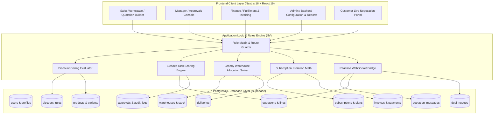

# 🌐 DealFlow360 — Next-Gen B2B Sales Operations & Quote-to-Cash Platform

<div align="center">

[](https://nextjs.org/)
[](https://react.dev/)
[](https://supabase.com/)
[](https://tailwindcss.com/)
[](https://www.typescriptlang.org/)
[](https://clerk.com/)

**An end-to-end sales execution platform engineered for complex B2B enterprises — unifying dynamic quotation building, multi-tier discount governance, algorithmic multi-warehouse fulfillment, hybrid subscription proration, real-time deal health monitoring, and in-app customer portal negotiation.**

</div>

---

## 📑 Table of Contents
- [Executive Overview](#-executive-overview)
- [System Architecture](#-system-architecture)
- [Key Outcomes & Core Features](#-key-outcomes--core-features)
- [Role-Based Access Control (RBAC) & Matrix](#-role-based-access-control-rbac--matrix)
- [Deep Mathematical & Algorithmic Logic](#-deep-mathematical--algorithmic-logic)
  - [1. Blended Discount Risk Score](#1-blended-discount-risk-score)
  - [2. Multi-Warehouse Greedy Set-Cover Allocation](#2-multi-warehouse-greedy-set-cover-allocation)
  - [3. Hybrid Billing & Day-Count Proration](#3-hybrid-billing--day-count-proration)
- [Complete End-to-End Sales Lifecycle (Quote-to-Cash)](#-complete-end-to-end-sales-lifecycle-quote-to-cash)
- [Database Schema (11 Relational Tables)](#-database-schema-11-relational-tables)
- [Quick Start & Setup](#-quick-start--setup)
- [Verification & QA Testing](#-verification--qa-testing)

---

## 🎯 Executive Overview

In enterprise B2B sales, a quotation is rarely a static checkout cart. It is a legally binding, multi-stakeholder commercial negotiation requiring discount oversight, inventory coordination across physical depots, complex recurring billing schedules, and executive risk governance.

**DealFlow360** eliminates disconnected spreadsheets and manual email chains by providing a single, coherent, real-time platform connecting **Sales Reps, Sales Managers, Finance Desks, Operations, Admins, and Customers**.

---

## 🏗️ System Architecture



---

## 🚀 Key Outcomes & Core Features

### 1. Multi-Tier Discount Governance & Automated Approval Chains
* **Tier-Based Ceilings**: Strict discount caps bound to customer tiers (*Standard 5%*, *Silver 10%*, *Gold 15%*, *Platinum 25%*).
* **Category Specificity**: Category rules (Hardware, Services, Subscriptions) override global rules to safeguard narrow-margin service offerings.
* **Automated Escalation Gates**:
  * Discount $> 10\% \longrightarrow$ Routed to **Sales Manager** (Level 1).
  * Discount $> 25\%$ OR Blended Margin $< 15\% \longrightarrow$ Escalated to **Finance VP** (Level 2).
  * Deal Size $> ₹1\text{ Crore} \longrightarrow$ **Admin** Sign-Off.
* **Audit Trail**: Every approve, reject, return-for-revision, or edit action is immutably logged with actor ID, timestamp, and justification.

### 2. Live Upsell & Cross-Sell Recommendation Engine
* **Context-Aware Suggestions**: Analyzes products in the quotation builder and suggests high-affinity pairings from historical co-purchase rules.
* **Real-Time Margin Impact**: Instantly displays estimated margin lift (e.g. `+3.2% Margin Lift`) and active promotion tags.
* **1-Click Insertion**: Injecting an upsell item instantly recalculates gross revenue, discount sums, and blended margin without page reload.

### 3. Multi-Warehouse Fulfillment Splitting & Backorder Handling
* **Greedy Set-Cover Allocation**: Solves multi-site inventory distribution to fulfill entire orders with the minimum number of shipments based on available stock and shipping cost weights.
* **Manual Dispatcher Override**: Operators can manually re-allocate stock quantities across warehouses via an interactive split dialog.
* **Backorder Consolidation**: Automatic prompts appear when inbound stock arrives to consolidate backordered deliveries.

### 4. Hybrid Billing & Day-Count Subscription Proration
* **Unified Orders**: A single quotation can seamlessly combine one-time physical hardware, one-off implementation fees, and recurring SaaS subscription plans.
* **Automated Invoicing & Schedules**: Automatically posts upfront invoices for one-time goods and provisions recurring billing schedules for SaaS subscriptions.
* **Mid-Cycle Proration Engine**: Computes exact day-count adjustments when subscription quantities or tiers change mid-billing cycle.
* **Cancellation & Credit Notes**: Generates automated credit notes upon subscription cancellation or refund triggers.

### 5. Real-Time Deal Health Monitoring & Anomaly Alerts
* **Stalled Quote Detection**: Automatically flags inactive quotes exceeding configured age thresholds ($> 7\text{ days}$).
* **Discount Anomaly Triggers**: Detects discounts exceeding $2.5\times$ a rep's historical baseline.
* **Delivery Slippage Indicators**: Identifies potential fulfillment promise breaches.
* **1-Click Manager Action**: Managers can trigger instant **Nudge Rep** or **Escalate Deal** actions directly from the dashboard.

### 6. Customer-Facing Portal with Live In-App Negotiation
* **Isolated Portal Route** (`/portal/[quoteId]`): Clean, customer-branded layout free from internal margins, cost data, or dashboard menus.
* **Real-Time Bidirectional Chat**: Customers and sales reps negotiate live with instant WebSocket message delivery.
* **Counter-Discount Proposals**: Customers can propose counter-discounts; if terms exceed governance boundaries, the quote automatically re-enters the approval queue.
* **1-Click Digital Sign-Off**: Instant acceptance transitions the quote into confirmed `ordered` / `invoiced` state.

### 7. Executive Reporting & Multi-Format Exports
* **Granular Filters**: Slice sales performance by Period (*Today, Week, Month, Quarter, Custom*), Rep/Team, Approval Stage, and Product Category.
* **Direct Exports**: 1-click downloads to **Microsoft Excel (.xlsx)** and **Printable PDF (.html)**.

---

## 👥 Role-Based Access Control (RBAC) & Matrix

DealFlow360 implements a centralized, zero-trust permissions matrix in [`lib/permissions.ts`](file:///Users/savansolanki/Desktop/DealFlow360/odoo-DealFlow360/lib/permissions.ts) enforced across UI components, server actions, and Postgres Row-Level Security (RLS).

| Module / Screen | Sales Rep (`rep`) | Sales Manager (`manager`) | Finance VP (`finance`) | Customer (`customer`) | Admin (`admin`) |
|---|:---:|:---:|:---:|:---:|:---:|
| **Quotation Builder** | `full (own)` | `view (all)` | `view (all)` | `none` | `full (all)` |
| **Approvals Console** | `view (own)` | `write (Level 1)` | `write (Level 2)` | `none` | `full (all)` |
| **Upsell Panel** | `use (own)` | `none` | `none` | `none` | `full (all)` |
| **Warehouse Split** | `write (own)` | `view (all)` | `full (all)` | `none` | `full (all)` |
| **Billing & Invoices** | `view (own)` | `view (all)` | `write (all)` | `none` | `full (all)` |
| **Customer Portal** | `write (own)` | `none` | `none` | `full (own)` | `none` |
| **Deal Health** | `view (own)` | `view (team)` | `view (all)` | `none` | `full (all)` |
| **Discount Rules Config** | `none` | `write` | `write (high)` | `none` | `full (all)` |
| **Warehouse & Stock Config** | `none` | `none` | `full` | `none` | `full (all)` |
| **Subscription Plans Config**| `none` | `none` | `full` | `none` | `full (all)` |
| **Reports & Exports** | `view (own)` | `view (team)` | `view (all)` | `none` | `full (all)` |

---

## 📐 Deep Mathematical & Algorithmic Logic

### 1. Blended Discount Risk Score

The blended risk score $(0 - 100)$ prevents reps from stealthily eroding deal margins across multiple lines. Implemented in [`lib/business-logic.ts`](file:///Users/savansolanki/Desktop/DealFlow360/odoo-DealFlow360/lib/business-logic.ts#L209):

$$\text{Risk Score} = 100 \times \left( 0.45 \cdot D_{\text{norm}} + 0.35 \cdot M_{\text{norm}} + 0.20 \cdot V_{\text{norm}} \right)$$

* **$D_{\text{norm}}$ (Discount Depth — 45% Weight)**: Normalized maximum discount across all quote lines:
  $$D_{\text{norm}} = \min\left(\frac{\text{Max Discount \%}}{40\%}, 1.0\right)$$
* **$M_{\text{norm}}$ (Margin Erosion — 35% Weight)**: Measures overall contract margin relative to safe $(30\%)$ and critical floor $(5\%)$ boundaries:
  $$M_{\text{norm}} = \min\left(\max\left(\frac{0.30 - \text{Margin \%}}{0.30 - 0.05}, 0\right), 1.0\right)$$
* **$V_{\text{norm}}$ (Deal Size Exposure — 20% Weight)**: Scales by total deal value up to $₹1\text{ Crore}$:
  $$V_{\text{norm}} = \min\left(\frac{\text{Net Amount}}{10,000,000}, 1.0\right)$$

### 2. Multi-Warehouse Greedy Set-Cover Allocation

Implemented in `splitOrderAcrossWarehouses()`, the allocator solves multi-site inventory optimization to fulfill orders with the fewest total shipments:

1. Sum outstanding product demand across all physical quote lines.
2. Rank warehouses by coverage quantity, tie-breaking by `shipping_cost_weight`, priority rank, and name.
3. Greedily allocate available inventory from the highest-ranking warehouse and deduct from demand.
4. Repeat until demand is satisfied or remaining items are flagged as backorders.

### 3. Hybrid Billing & Day-Count Proration

Implemented in `prorateSubscription()`, mid-cycle subscription changes calculate exact credit/debit adjustments based on elapsed billing days:

$$\text{Prorated Delta} = (\text{New Price} - \text{Old Price}) \times \frac{\text{Days Remaining in Cycle}}{\text{Total Days in Billing Period}}$$

---

## 🔁 Complete End-to-End Sales Lifecycle (Quote-to-Cash)

```
1. Rep Login & Workspace Initialization (/quotations)
      │
2. Backend Catalog & Rules Active (/backend/*)
      │
3. Create Quotation & Select Customer Tier
      │
4. Add Products + Line Discounts + Upsell Recommendations
      │
5. Governance Evaluation:
   ├── Discount ≤ Tier Limit ──► Auto-Approved (Bypasses Review)
   └── Discount > Threshold ───► Multi-Tier Approval (/approvals)
                                 (Sales Manager → Finance VP)
      │
6. Multi-Warehouse Fulfillment Splitting (/fulfillment)
      │
7. Hybrid Billing Schedule Provisioned (/subscriptions & /invoices)
      │
8. Customer Portal Negotiation & Live Chat (/portal/[quoteId])
      │
9. Counter-Proposal Check:
   ├── Within Ceilings ────────► 1-Click "Accept & Sign"
   └── Exceeds Ceilings ───────► Re-Enters Approval Queue
      │
10. Order Dispatch & Payment Reconciliation (/invoices/[id])
      │
11. Real-Time Deal Health Monitoring & Nudges (/deal-health)
      │
12. Executive Reporting & Analytics Export (/reports)
```

---

## 🗄️ Database Schema (11 Relational Tables)

The database schema is fully normalized in PostgreSQL with foreign key relationships, indexes, and Row-Level Security:

1. **`products`**: Catalog items, SKU, category, list price, cost, unit of measure, tax rate, and attributes.
2. **`product_variants`**: Specific SKUs, attribute permutations, and price deltas.
3. **`customers`**: Customer master, tier classification (`standard`, `silver`, `gold`, `platinum`), credit limits.
4. **`discount_rules`**: Tier-, category-, and product-scoped discount ceilings and approval triggers.
5. **`quotations`**: Core deal header, quote number, customer ID, rep ID, stage, gross/net totals, margin, risk score.
6. **`quotation_lines`**: Itemized lines, product ID, quantity, unit price, line discount %, recurring flag.
7. **`approvals`**: Multi-tier approval records, level (`manager`, `finance`, `admin`), decision, timestamp, notes.
8. **`warehouses` & `warehouse_stock`**: Depots, stock on hand, allocated quantities, replenishment thresholds, shipping weights.
9. **`deliveries`**: Multi-warehouse split dispatches, tracking numbers, and fulfillment status.
10. **`subscriptions` & `invoices`**: Recurring billing schedules, payment ledger (`bank_transfer`, `card`, `upi`), and credit notes.
11. **`quotation_messages` & `deal_nudges`**: Realtime chat messages and manager escalation notes.

---

## ⚡ Quick Start & Setup

### Prerequisites
* **Node.js**: v20.x or v22.x
* **npm** / **pnpm** / **yarn**
* **Supabase Project** & **Clerk Account**

### Installation

1. **Clone the repository**:
   ```bash
   git clone https://github.com/AmreliyaAakash/odoo-DealFlow360.git
   cd odoo-DealFlow360
   ```

2. **Install dependencies**:
   ```bash
   npm install
   ```

3. **Configure Environment Variables**:
   Create a `.env.local` file in the root directory:
   ```env
   # Clerk Authentication
   NEXT_PUBLIC_CLERK_PUBLISHABLE_KEY=pk_test_...
   CLERK_SECRET_KEY=sk_test_...

   # Supabase Database
   NEXT_PUBLIC_SUPABASE_URL=https://your-project.supabase.co
   NEXT_PUBLIC_SUPABASE_ANON_KEY=eyJhbGciOi...
   SUPABASE_SERVICE_ROLE_KEY=eyJhbGciOi...
   ```

4. **Seed Database**:
   ```bash
   npm run db:build
   ```

5. **Start Development Server**:
   ```bash
   npm run dev
   ```
   Open [http://localhost:3000](http://localhost:3000) in your browser.

---

## 🧪 Verification & QA Testing

The project includes an extensive QA test suite verifying all mathematical rules, access control layers, and end-to-end flows:

```bash
# Run TypeScript compilation check
npm run typecheck

# Run build integrity check
npm run build:check

# Run end-to-end QA validation scripts
node scripts/qa-business-logic.mjs
node scripts/qa-access-matrix.mjs
node scripts/qa-billing.mjs
```

---

<div align="center">

**Built with precision for the Odoo Hackathon 2026** • Designed for High-Velocity B2B Sales Operations.

</div>
